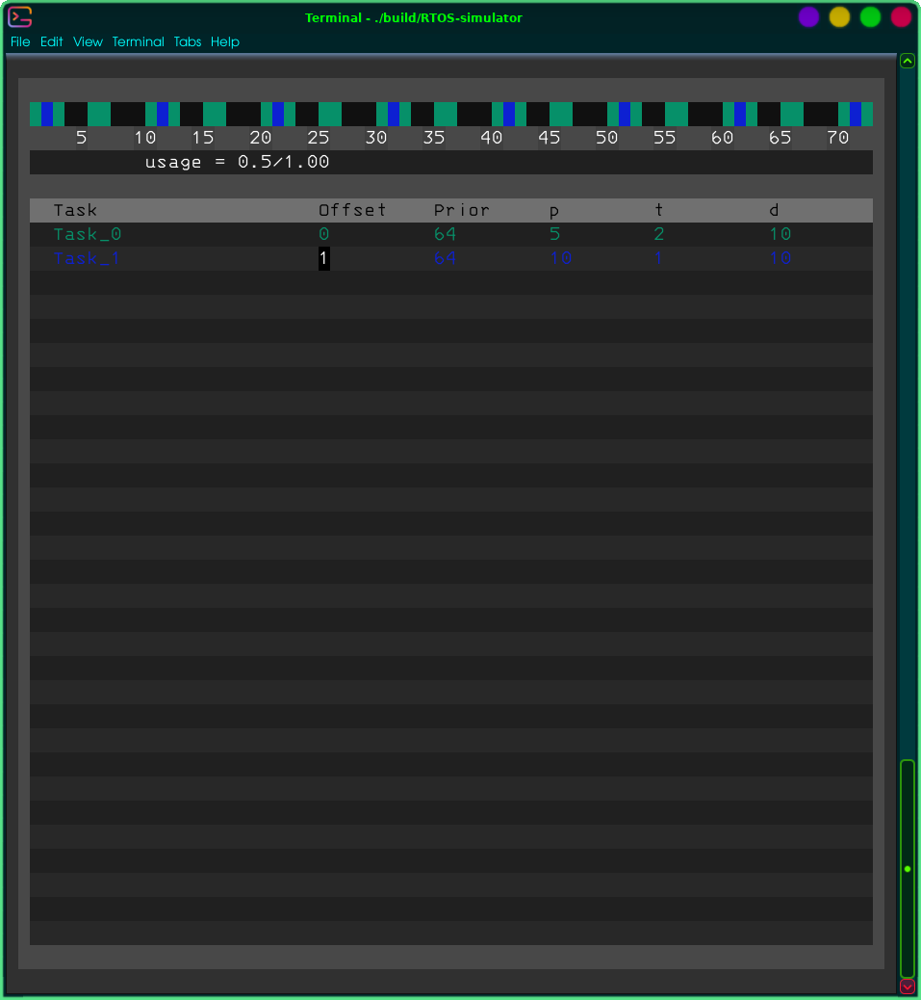

# RTOS-simulator
### overcomplicated approach to RTOS visualisation with terminal graphics

### Overview
Real time operational systems operate by interrupting tasks of lower priotity by those which are of higher priority.

This exactly is shown here.

### Launch
It works on Linux. **Launching comp.sh from terminal** must create executable "RTOS-simulator" in "build" directory. Launching RTOS-simulator from terminal starts the program.

### Controls
- A: adds a task
- D: removes a task
- Arrow keys: navitage cursor between tasks and values
- ESC: closes the program
